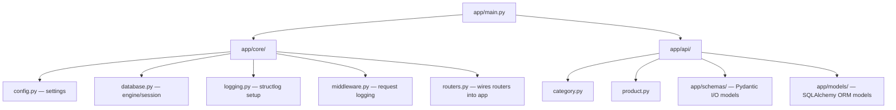
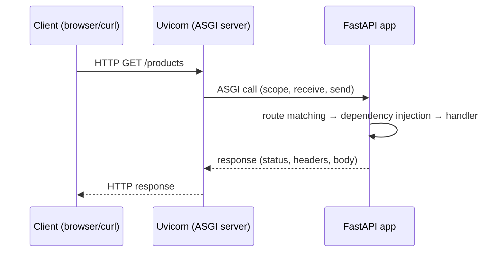
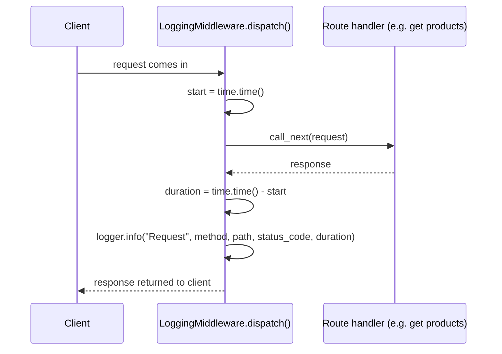
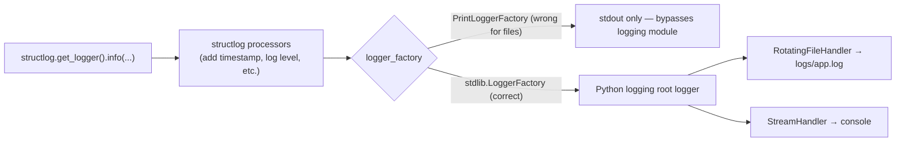
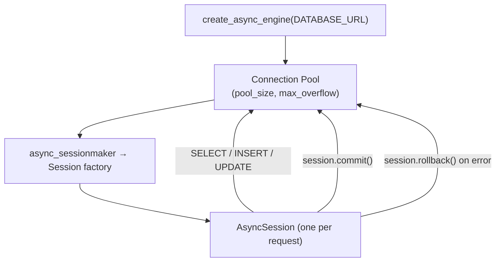
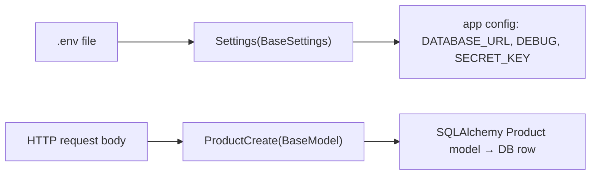
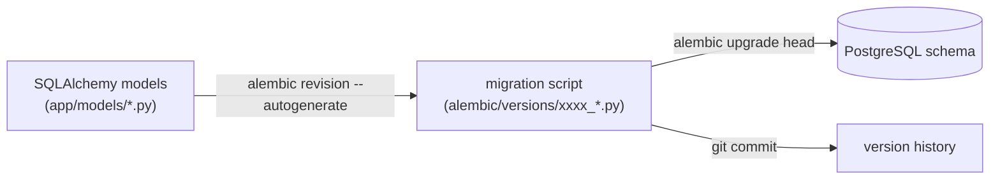
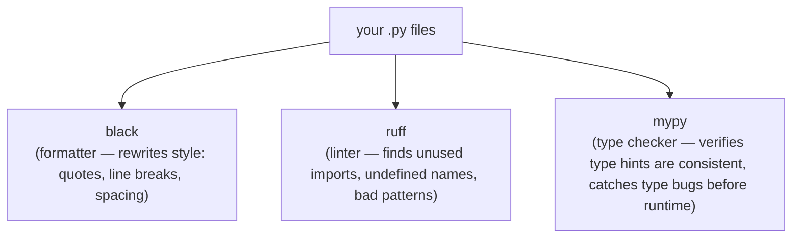
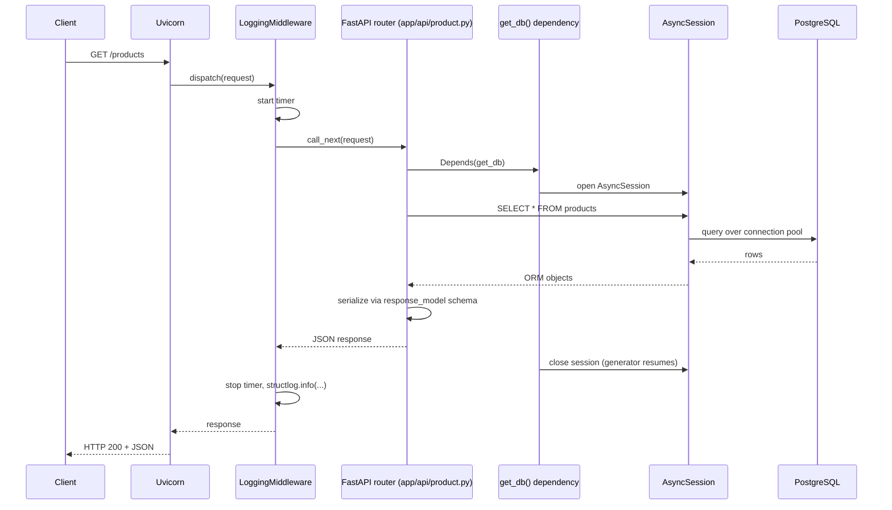

# Day 1 Review & Backend Concepts Glossary

## Part 1 — Day 1 Checklist Review

You checked all 8 boxes for Day 1. I ran the app and inspected the files to verify. Verdict: **mostly correct, with 4 real issues** worth fixing before Day 2.

| # | Task | Status | Note |
|---|------|--------|------|
| 1 | GitHub repo + `.gitignore` | ✅ | Remote `origin` set, `.gitignore` present |
| 2 | Deps installed (`fastapi`, `uvicorn`, `sqlalchemy`, `asyncpg`, `alembic`, `pydantic-settings`, `python-dotenv`, `structlog`) | ✅ | All in `pyproject.toml`, installed via `uv` (fine — `uv` is the modern drop-in the plan mentions) |
| 3 | `pyproject.toml` with black/ruff/mypy config | ⚠️ | Config exists, but `Makefile`'s `check` target is broken — see Issue A below |
| 4 | Folder scaffold: `app/`, `app/api/`, `app/models/`, `app/schemas/`, `app/core/`, `alembic/` | ⚠️ | Everything exists **except `alembic/`** — see Issue B |
| 5 | `app/core/config.py` with pydantic-settings | ✅ | Loads `DATABASE_URL`, `DEBUG`, `SECRET_KEY` correctly |
| 6 | `app/core/database.py` — async engine + session factory + `get_db` | ✅ | Correct shape, but see Issue C (latent bug) |
| 7 | `app/main.py` + structlog middleware logging method/path/status/duration | ⚠️ | Works, but field is `duration` not `duration_ms` as the plan specifies, and see Issue D (security smell) |
| 8 | `uvicorn app.main:app --reload` starts, `/docs` reachable | ✅ | Verified live — server boots, `/docs` returns 200 |

### Issue A — `Makefile` `check` target is broken
```makefile
check: formatlint type-check
```
This is missing a space — Make reads `formatlint` as one nonexistent target, so `make check` will fail immediately. Should be:
```makefile
check: format lint type-check
```

### Issue B — `alembic/` folder never scaffolded
The plan lists `alembic/` explicitly as a Day 1 folder (even though you don't configure it until Day 2). Run `uv run alembic init alembic` before you start Day 2's migration work, otherwise Day 2's "Configure `alembic.ini`" step has nothing to configure.

### Issue C — `DATABASE_URL` driver isn't installed
Your `.env` sets:
```
DATABASE_URL="sqlite+aiosqlite:///database.db"
```
but `aiosqlite` isn't a dependency (`import aiosqlite` fails — confirmed). `create_async_engine()` doesn't connect eagerly, so the app *starts* fine, but the first real query (Day 2/3) will crash with `ModuleNotFoundError`. Also worth noting: the plan's whole stack is PostgreSQL + `asyncpg`, not SQLite — using SQLite for now is a reasonable local shortcut, but either add `aiosqlite` to `pyproject.toml` or switch `.env` to a real Postgres URL before Day 2.

### Issue D — root `/` endpoint leaks `SECRET_KEY`
```python
data = {
    "database_url": settings.DATABASE_URL,
    "secret_key": settings.SECRET_KEY,
    "edit_mode": settings.DEBUG
}
```
This is presumably a debug scratch endpoint, but it's a bad habit to get into — `SECRET_KEY` will sign your JWTs starting Day 9. Worth deleting or gating behind `if settings.DEBUG` now, before it's forgotten.

### Minor / not blocking
- `duration` is a raw float in seconds (`time.time() - start`), the plan asks for `duration_ms`. Purely cosmetic, but interviewers may ask "why seconds not ms" — pick one on purpose.
- `.env.example` exists but is **empty** — not a Day 1 requirement (that's Day 4), but easy to fill in now while the vars are fresh.
- `Sessionlocal` in `database.py` should be `SessionLocal` per PEP 8 (class-like name), pure style nit.

None of this blocks moving to Day 2 — fix the Makefile typo and decide on the DB driver first, since Day 2 will immediately exercise both.

---

## Part 2 — Concept Glossary (with diagrams)

### 1. Project layout



- **`app/core/`** — cross-cutting concerns: settings, DB connection, logging, middleware. Nothing here knows about specific business entities.
- **`app/api/`** — route handlers (the "controller" layer). Currently talks to the DB directly; Day 8 refactors this into router → service → repository.
- **`app/models/`** — SQLAlchemy classes, one per DB table.
- **`app/schemas/`** — Pydantic classes that define what the API accepts/returns. Kept separate from `models/` on purpose (see #5).

---

### 2. FastAPI + Uvicorn (ASGI)

FastAPI is a **framework** — it defines routes, validates request bodies, generates OpenAPI docs. It doesn't run a server by itself.

Uvicorn is the **ASGI server** — the actual process that listens on a TCP port, speaks HTTP, and calls into your FastAPI app for each request.



ASGI (Asynchronous Server Gateway Interface) is why FastAPI can use `async def` handlers — the older WSGI standard (Flask/Django classic) handles one request per worker thread and blocks on I/O; ASGI lets one worker juggle many concurrent requests while waiting on the DB/network.

---

### 3. Middleware

Middleware wraps **every** request/response, before/after the route handler runs. Your `LoggingMiddleware` (`app/core/middleware.py`) is a concrete example:



Key point: middleware runs for **every** route automatically — you don't call it from each handler. That's why it's the right place for cross-cutting stuff like request logging, timing, CORS, or auth-token extraction (Day 11+).

`BaseHTTPMiddleware` (what you're using) wraps `call_next` — code before `call_next` runs on the way *in*, code after runs on the way *out*.

---

### 4. Logging: stdlib `logging` vs `structlog`

Two different libraries are stacked here, and this is exactly what tripped you up earlier today:

- **`logging`** (Python stdlib) — has *handlers* (where logs go: file, stdout, network) and *formatters* (how they're rendered as text).
- **`structlog`** — wraps logging calls to produce **structured** (key=value / JSON) log events instead of free-text strings, which is much easier to query in production (e.g. "show me all logs where `status_code=500`").

The catch: structlog needs to be told to **feed into** stdlib logging's handlers, or it does its own thing (e.g. `PrintLoggerFactory` just calls `print()` and never touches your file handler — this was today's bug).



Current setup (`app/core/logging.py`, fixed today):
1. `logging.basicConfig(handlers=[RotatingFileHandler(...), StreamHandler()])` — registers where logs physically go.
2. `structlog.configure(..., logger_factory=structlog.stdlib.LoggerFactory())` — routes structlog calls into that stdlib logging setup instead of bypassing it.
3. `RotatingFileHandler` caps the file at `maxBytes` and keeps `backupCount` rotated copies (`app.log`, `app.log.1`, `app.log.2`, ...) so logs don't grow forever.

---

### 5. SQLAlchemy sessions & the async engine



- **Engine**: owns the connection pool to Postgres. Created once, at import time.
- **Session**: a single unit-of-work — tracks objects you've loaded/changed, and issues SQL when you call `commit()`. A **new session per request** is the standard pattern (that's what `get_db()` does via FastAPI's `Depends`).
- **`get_db()` as a FastAPI dependency**: FastAPI calls this generator, hands the yielded session to your route handler, and — critically — resumes the generator after the response is built to close the session (via the `async with` block), even if the handler raised an exception.

```python
async def get_db():
    async with Sessionlocal() as session:
        yield session   # handler runs here, using this session
    # session automatically closed when this function resumes
```

Why **async** session/engine matters: a *sync* DB call blocks the entire event loop — while Postgres is thinking, your ASGI server can't handle *any other* request on that worker. Async lets the event loop switch to another request while waiting on I/O.

---

### 6. Pydantic Settings vs Pydantic Schemas

Two different jobs, both using Pydantic's validation engine:

| | `app/core/config.py` (`Settings`) | `app/schemas/*.py` (`ProductCreate`, etc.) |
|---|---|---|
| Reads from | Environment variables / `.env` file | HTTP request body (JSON) |
| Created | Once, at app startup | Once per request |
| Purpose | Type-safe, validated app configuration | Define the API's public input/output contract |



**Why schemas are separate from ORM models**: the ORM model (`app/models/product.py`) mirrors your DB table exactly, including internal fields you never want exposed (e.g. a future `deleted_at`). The Pydantic schema (`app/schemas/product.py`) is the *contract* — `response_model=ProductRead` strips anything not explicitly listed, so adding an internal DB column never accidentally leaks it in an API response.

---

### 7. Alembic (migrations) — not yet scaffolded

Alembic is a **version control system for your DB schema**. Instead of manually running `ALTER TABLE` in psql, you write/generate migration scripts that are checked into git.



You haven't run `alembic init alembic` yet (Issue B above) — that's needed before Day 2's "Configure `alembic.ini`" step has a folder to configure.

---

### 8. Code quality tools: black, ruff, mypy

Three tools, three different jobs — they don't overlap:



- **black**: opinionated auto-formatter. You never argue about tabs vs spaces or quote style — `black .` just rewrites the file. Config: `line-length = 88`.
- **ruff**: fast linter (replaces flake8/isort/etc.). Your config (`select = ["E", "F", "I"]`) checks pycodestyle errors (`E`), pyflakes (unused imports/vars, `F`), and import sorting (`I`).
- **mypy**: static type checker. With `strict = true`, every function needs type hints, and mypy will flag things like passing a `str` where an `int` is expected — caught before you ever run the code.

Run order in CI (Day 7 sets this up): `ruff check` → `mypy` → `pytest`. Your `Makefile` wires these as `make lint`, `make type-check`, `make format` (and `make check` once Issue A is fixed).

---

### 9. `uv` and `pyproject.toml`

`uv` is a fast, modern replacement for `pip` + `venv` + `pip-tools`. Key files:

- **`pyproject.toml`** — declares dependencies (`[project.dependencies]`) and dev-only tools (`[dependency-groups.dev]`), plus tool config (`[tool.black]`, `[tool.ruff]`, `[tool.mypy]`) in one file.
- **`uv.lock`** — exact resolved versions of every dependency (and transitive dependency), committed to git so every machine gets identical installs.
- **`.python-version`** — pins the Python version (`3.14` here) that `uv run` will use/create a venv for.

`uv run <command>` runs `<command>` inside the project's managed virtualenv without you needing to manually activate it.

---

### 10. Request lifecycle, end to end

Putting it all together — what happens on `GET /products` right now:



This is the shape every future endpoint follows, and it's why the layering (middleware → router → dependency → session → DB) matters: each piece has exactly one job.
