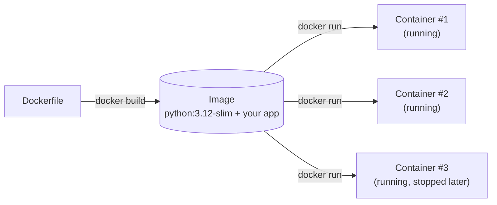
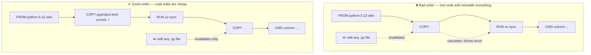
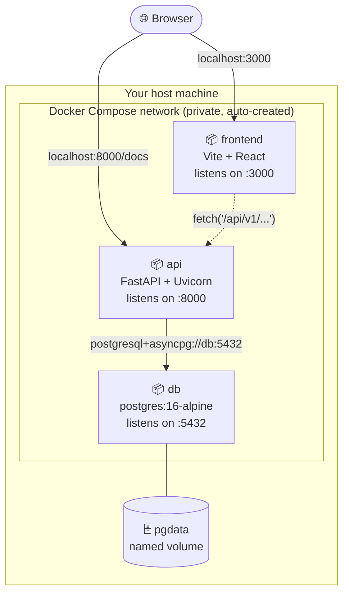
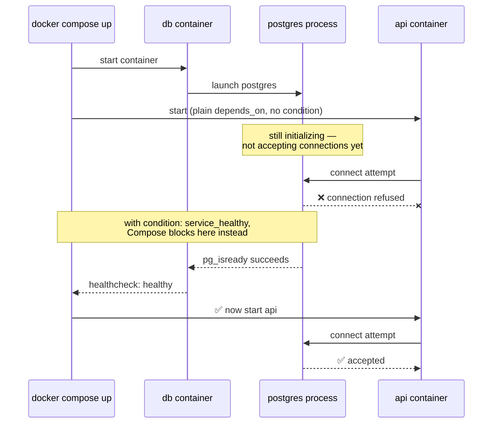
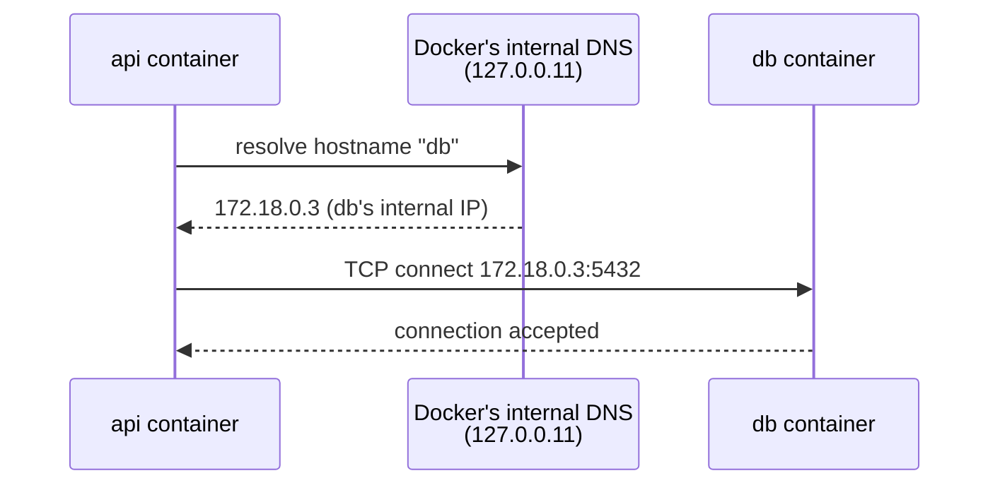
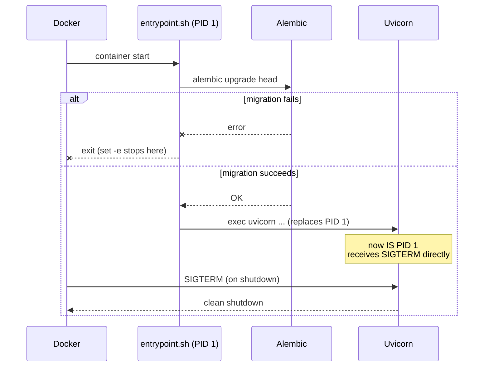

# Docker & Docker Compose — A Guide for This Project

This is a from-scratch guide to Docker and Docker Compose, written specifically around your `e-commerce` project (Day 4 of your plan: FastAPI backend, Postgres database, React frontend, all wired together with Docker Compose). Read it top to bottom once, then use it as a reference while you build.

---

## 1. What Docker actually is

Your machine right now runs Python 3.14 (per `.python-version`), has `uv`, has SQLite, has a specific OS. If you send this project to someone else — or deploy it to a server — none of that is guaranteed to match. "Works on my machine" is the problem Docker solves.

**A container is not a virtual machine.** A VM virtualizes an entire computer, including its own kernel — heavy, slow to start. A container shares your host machine's kernel and just isolates a *process* (its filesystem, network, and resource view). That's why containers start in milliseconds and a VM takes tens of seconds.

Two words you'll use constantly:

- **Image** — a read-only, frozen snapshot: "Python 3.12 + these files + these installed packages." It's a *blueprint*. You build it once from a `Dockerfile`.
- **Container** — a *running instance* of an image. You can start, stop, and destroy containers; the image they came from is untouched. You can run the same image as five containers at once.

Analogy: an image is a class, a container is an object instantiated from it.



One image, built once, can be started as any number of independent containers — each with its own filesystem changes and process state, none of which affect the original image or each other.

---

## 2. Dockerfile — building your API's image

A `Dockerfile` is a recipe: a sequence of instructions that produce an image, executed top-to-bottom.

### The instructions you'll actually use

| Instruction | What it does |
|---|---|
| `FROM <image>` | The base image to start from. Must be the **first** instruction. |
| `WORKDIR <path>` | Sets the working directory inside the image for every instruction after it (like `cd`, but persists). Creates the directory if it doesn't exist. |
| `COPY <src> <dest>` | Copies files from your machine (the "build context") into the image. |
| `RUN <command>` | Executes a shell command *while building* the image (e.g. installing packages). Each `RUN` creates a new image layer. |
| `ENV <key>=<value>` | Sets an environment variable that persists into the running container. |
| `EXPOSE <port>` | Documentation only — tells humans/tools which port the app listens on. Does **not** actually publish the port (that's `docker compose`'s `ports:` or `docker run -p`). |
| `CMD [...]` | The default command that runs when a container **starts** (not during build). Only one `CMD` takes effect — the last one wins. |
| `ENTRYPOINT [...]` | Similar to `CMD`, but harder to override at runtime. Often used together: `ENTRYPOINT` is the fixed executable, `CMD` supplies default arguments to it. |

### A critical, real bug in your current `backend/Dockerfile`

You have:
```dockerfile
FROM: python:3.12-slim
```
That colon after `FROM` is invalid Dockerfile syntax — `FROM` takes the image name directly, no colon. This will fail immediately with a parse error the moment you try to build. Correct form:
```dockerfile
FROM python:3.12-slim
```

### Layers and caching — why instruction *order* matters

Every `RUN`, `COPY`, and `ADD` creates a cached **layer**. When you rebuild, Docker reuses layers from the top down *until it hits the first instruction that changed* — everything after that gets rebuilt.

This means: **put things that change rarely (dependency installs) before things that change often (your source code).** If you `COPY . .` (your whole app) before installing dependencies, then every single code edit invalidates the dependency-install layer too — meaning `uv sync`/`pip install` reruns on every build, even though your dependencies didn't change. That's the single most common Docker performance mistake beginners make.



In the bad ordering, the dependency-install layer (`RUN uv sync`) sits *after* `COPY . .`, so any source file change invalidates it too — every rebuild reinstalls every dependency from scratch. In the good ordering, `RUN uv sync` only depends on `pyproject.toml`/`uv.lock`, so it stays cached across ordinary code edits — only the final `COPY . .` layer rebuilds.

Correct order:
```dockerfile
FROM python:3.12-slim

WORKDIR /app

# 1. Copy ONLY dependency manifests first
COPY pyproject.toml uv.lock ./

# 2. Install deps — this layer is cached as long as these two files don't change
RUN pip install uv && uv sync --frozen --no-dev

# 3. NOW copy the rest of your source code — this changes on every edit,
#    but it no longer invalidates the (expensive) dependency layer above
COPY . .

EXPOSE 8000

CMD ["uv", "run", "uvicorn", "app.main:app", "--host", "0.0.0.0", "--port", "8000"]
```

Notes specific to your project:
- Your project uses **`uv`** (you have `pyproject.toml` + `uv.lock`, not a `requirements.txt`) — your plan's generic instructions say "install deps from `requirements.txt`," but that doesn't apply here; use `uv sync` instead. `uv sync --frozen` installs exactly what's pinned in `uv.lock`, which is what you want in a container (reproducible, no surprise version bumps).
- `--host 0.0.0.0` is not optional inside a container. `127.0.0.1`/`localhost` only accepts connections *from inside the same network namespace*. Docker Compose reaches your API from other containers and from your host machine's port mapping — both look like "outside" traffic to the container, so the server must bind to `0.0.0.0` (all interfaces) or nothing outside the container can reach it. This is one of the most common "my Dockerized API doesn't respond" bugs.
- `EXPOSE 8000` is documentation. It does nothing on its own — you still need `ports:` in `docker-compose.yml` to actually make it reachable from your host machine.

### `.dockerignore`

Just like `.gitignore`, but for what gets sent into the Docker build context. Without it, `COPY . .` will copy your `.venv/`, `__pycache__/`, `logs/`, `database.db`, `.git/` — bloating your image and build time, and potentially leaking local secrets/state into the image. Create `backend/.dockerignore`:
```
.venv/
__pycache__/
*.pyc
.git/
.mypy_cache/
.ruff_cache/
logs/
database.db
.env
```
(Keep `.env.example` out of this list — you *do* want that one in version control, just not the real `.env`.)

### Multi-stage builds (not needed yet — just so you recognize the term)

Your plan explicitly says "multi-stage NOT yet — keep simple" for Day 4, so skip this for now. Briefly: a multi-stage build uses multiple `FROM` instructions in one Dockerfile — one stage compiles/builds, a second stage copies only the *final artifacts* into a slim runtime image, discarding build tools and intermediate files. It shrinks final image size. You'll want it eventually (compiled dependencies, frontend build artifacts), but not this week.

---

## 3. Docker Compose — orchestrating multiple containers

A single `Dockerfile` builds *one* image. Your app needs **three** coordinated services running together: `api`, `db`, `frontend`. You could `docker run` each manually with matching network flags, but that's tedious and unrepeatable — `docker-compose.yml` describes the whole stack declaratively, and `docker compose up` brings all of it up together, networked, in the right order.



Inside the dashed network boundary, services address each other **by service name** (`db`, `api`) — that's covered in the networking section below. Only the `ports:` you explicitly publish (the solid arrows from the browser) are reachable from outside the network.

### Anatomy of a `docker-compose.yml`

```yaml
services:
  api:
    build: ./backend          # build an image from backend/Dockerfile
    ports:
      - "8000:8000"            # host_port:container_port
    environment:
      DATABASE_URL: postgresql+asyncpg://postgres:postgres@db:5432/ecommerce
    depends_on:
      db:
        condition: service_healthy
    volumes:
      - ./backend:/app         # optional, for live-reload in dev

  db:
    image: postgres:16-alpine   # no Dockerfile needed — using an official image directly
    environment:
      POSTGRES_USER: postgres
      POSTGRES_PASSWORD: postgres
      POSTGRES_DB: ecommerce
    ports:
      - "5432:5432"
    volumes:
      - pgdata:/var/lib/postgresql/data
    healthcheck:
      test: ["CMD-SHELL", "pg_isready -U postgres"]
      interval: 5s
      timeout: 5s
      retries: 5

  frontend:
    build: ./frontend
    ports:
      - "3000:3000"
    volumes:
      - ./frontend:/app
      - /app/node_modules       # anonymous volume — see note below

volumes:
  pgdata:                       # declares the named volume used above
```

### Field-by-field, mapped to what you actually need

**`build:` vs `image:`** — `build: ./backend` tells Compose "build an image from the Dockerfile in this directory." `image: postgres:16-alpine` says "just pull this pre-built image from Docker Hub, no Dockerfile needed." You don't need to write a Dockerfile for Postgres — the official image already does everything you need, configured entirely through environment variables.

**`ports:`** — `"8000:8000"` means "host port 8000 → container port 8000." The number on the *left* is what you type in your browser; the number on the *right* must match what the app inside the container actually listens on (`EXPOSE`/your `uvicorn --port`). They don't have to match each other (`"8080:8000"` is valid — browser hits `:8080`, container still listens on `:8000`), but for local dev, keeping them identical avoids confusion.

**`environment:`** — injects environment variables into the container. This is how you'll override `DATABASE_URL` for the containerized environment: your current `.env` points at SQLite (`sqlite+aiosqlite:///database.db`), but inside Compose you'll point at the `db` service instead, using `asyncpg` (which is already in your `pyproject.toml` dependencies, unused so far):
```
postgresql+asyncpg://postgres:postgres@db:5432/ecommerce
```
Note the hostname is literally `db` — the *service name* from this same compose file, not `localhost`. See networking below.

**`depends_on:`** — controls **startup order**, not readiness. `depends_on: db` alone only waits for the `db` *container to start* — not for Postgres to actually finish initializing and accept connections (which takes a few extra seconds). This is exactly the "Pitfall to Avoid" your plan calls out: *"the API will fail on startup if Postgres isn't ready."* The fix is `condition: service_healthy`, which makes Compose wait for the `db` service's `healthcheck:` to report healthy before starting `api`.

**`healthcheck:`** — a command Docker runs periodically *inside* the container to decide if it's actually working, not just running. `pg_isready` is Postgres's own built-in tool for exactly this. Without a healthcheck, `depends_on: db` has nothing to wait on.



Plain `depends_on: db` only guarantees the *left* path (api starts as soon as the container process exists) — which is exactly what causes the "connection refused on startup" bug. `condition: service_healthy` forces the *right* path.

**`volumes:`** — two very different uses, both shown above:
1. **Named volume** (`pgdata:/var/lib/postgresql/data`) — Docker manages this storage outside any container's filesystem. Without it, every time you `docker compose down` and back up, Postgres's actual database files vanish with the container, and you lose all your data. The named volume persists independently of container lifecycle.
2. **Bind mount** (`./backend:/app`) — maps a folder on *your host machine* directly into the container. Used in dev so your local code edits show up live inside the running container without rebuilding the image. `/app/node_modules` as an *anonymous* volume (no name, no host path) is a common trick for Node projects: it prevents your host's bind-mounted folder from shadowing/overwriting the `node_modules` that was installed *inside* the image during build (host and container OS can have incompatible native binaries otherwise).

### Networking — how `api` finds `db`

This is directly one of your plan's "Interview Readiness" questions, so understand it properly: every `docker-compose.yml` automatically creates a private network shared by all its services. Inside that network, **each service is reachable by other services using its service name as a hostname** — Docker runs an internal DNS server that resolves `db` → the `db` container's internal IP address automatically. That's *why* `DATABASE_URL` inside the container says `@db:5432` and not `@localhost:5432` — from the `api` container's point of view, `localhost` means *itself*, not the `db` container. This trips up almost everyone the first time.



The service *name* in `docker-compose.yml` (`db`) becomes a real, resolvable hostname automatically — you never hardcode an IP address.

From *your host machine* (outside any container), you'd instead use `localhost:5432` (via the `ports:` mapping) — e.g. connecting with `psql` directly from your terminal.

---

## 4. `entrypoint.sh` — run migrations, then start the server

Your plan wants migrations to run automatically when the `api` container starts: `alembic upgrade head && uvicorn ...`. Why not just put that directly as `CMD` in the Dockerfile? You *could*, but a separate script is clearer and more flexible (e.g., later you might add "wait for db," logging, or conditional logic).

`backend/entrypoint.sh`:
```bash
#!/bin/sh
set -e

alembic upgrade head
exec uvicorn app.main:app --host 0.0.0.0 --port 8000
```

- `set -e` — exit immediately if `alembic upgrade head` fails, instead of silently starting a server against an unmigrated database.
- `exec` — replaces the shell process with uvicorn instead of running it as a child process. This matters for signal handling: without `exec`, when Docker sends a `SIGTERM` to stop your container, it goes to the shell script, not to uvicorn, so uvicorn might not shut down cleanly (or Docker has to wait for a timeout and force-kill it).



In the Dockerfile:
```dockerfile
COPY entrypoint.sh .
RUN chmod +x entrypoint.sh
ENTRYPOINT ["./entrypoint.sh"]
```
Remember: the script needs execute permission (`chmod +x`) both on your host *and* verified inside the image, since file permissions can behave inconsistently across OSes/git configs.

---

## 5. Environment variables — three places, one source of truth

You'll have variables defined in up to three places; understand the precedence:

1. **`ENV` in the Dockerfile** — baked into the image itself. Rarely used for secrets (they'd be baked into the image permanently).
2. **`environment:` in `docker-compose.yml`** — injected at container start. Overrides anything from the Dockerfile.
3. **`env_file: .env`** in `docker-compose.yml` — loads a `.env` file's contents as environment variables. Compose also automatically reads a `.env` file sitting next to `docker-compose.yml` itself for variable *substitution inside the compose file* (`${SOME_VAR}` syntax) — this is a different mechanism from `env_file:` on a service, and both can coexist.

Your `backend/.env.example` is currently empty — per your Day 4 checklist ("Add `.env.example` file with all required env vars; document each in a comment"), fill it in with the shape of what's needed, without real secrets:
```
# SQLite for local dev without Docker; overridden by docker-compose for containerized Postgres
DATABASE_URL=sqlite+aiosqlite:///database.db
DEBUG=True
SECRET_KEY=changeme-generate-a-real-random-value
```

---

## 6. Commands you'll actually run

| Command | What it does |
|---|---|
| `docker compose up` | Create and start all services, attached (logs stream to your terminal). |
| `docker compose up -d` | Same, but detached (runs in the background). |
| `docker compose up --build` | Force image rebuild before starting — use this whenever you change a Dockerfile or dependencies. |
| `docker compose down` | Stop and remove containers + the default network. Named volumes (like `pgdata`) survive. |
| `docker compose down -v` | Same, but **also deletes volumes** — this wipes your Postgres data. Use deliberately. |
| `docker compose logs -f api` | Stream logs from just the `api` service. |
| `docker compose ps` | List running services and their status/health. |
| `docker compose exec api sh` | Open a shell *inside* the running `api` container — useful for poking around, running `alembic` manually, etc. |
| `docker compose restart api` | Restart just one service without rebuilding. |

---

## 7. Debugging checklist (the errors you will actually hit)

- **"Connection refused" from `api` to `db` right at startup** → almost always the `depends_on`/healthcheck issue above. Postgres's container process starts fast, but the database itself isn't ready to accept connections for a few seconds.
- **API unreachable from your browser, but the container is "running"** → check you bound to `0.0.0.0`, not `127.0.0.1`/`localhost`, inside the container.
- **Code changes don't show up** → if you're not using a bind-mount volume, you're editing files that only exist on your host — the image was already built with the old code baked in. Either add a bind mount for dev, or `docker compose up --build` after every change (slow, not recommended for active dev).
- **`node_modules` errors / native binary mismatches for the frontend** → the anonymous-volume trick (`/app/node_modules` with no host path) mentioned above.
- **Postgres data seems to "reset"** → you ran `docker compose down -v`, or never declared a named volume for `/var/lib/postgresql/data` in the first place.
- **Build seems to reinstall all dependencies on every single code change** → dependency files aren't being `COPY`'d and installed *before* the rest of your source code (see the layer-caching section above).
- **"port is already allocated"** → something on your host (or another container) is already using that port. Change the host-side port in `ports:` (e.g. `"5433:5432"`) or stop the conflicting process.

---

## 8. Your Day 4 checklist, mapped to the concepts above

| Checklist item | Where to look above |
|---|---|
| Write `Dockerfile` for FastAPI | §2 — fix the `FROM:` typo, use `uv`, order layers correctly |
| Write `docker-compose.yml` with `api` + `db` + healthcheck | §3 |
| `.env.example` with documented vars | §5 |
| `docker compose up --build` works, `/docs` reachable | §6 |
| Run Alembic migrations on container startup via `entrypoint.sh` | §4 |
| Scaffold React app, add `frontend` service | §3 (the `frontend` service block) |
| All three services start together | §3 networking section explains why `db`/`api` can see each other by service name |

Once you've written the actual `Dockerfile`, `docker-compose.yml`, and `entrypoint.sh`, ask me to review them against everything above — I'll check line by line.
