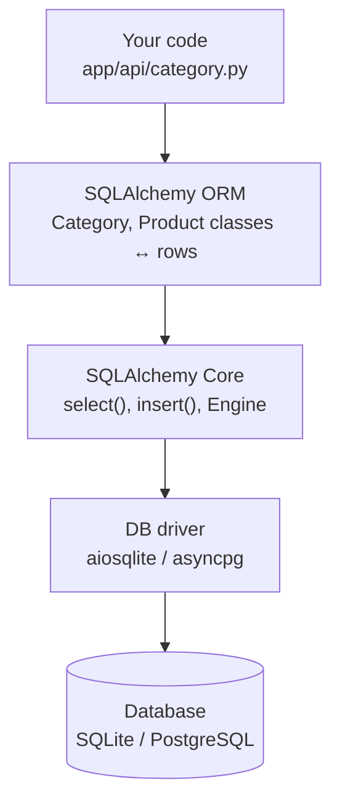
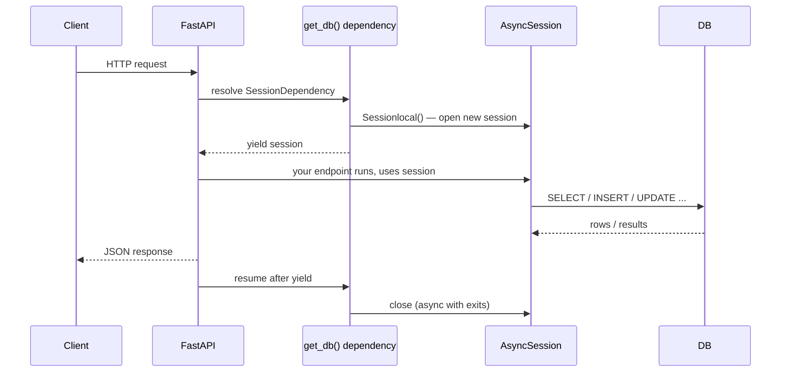
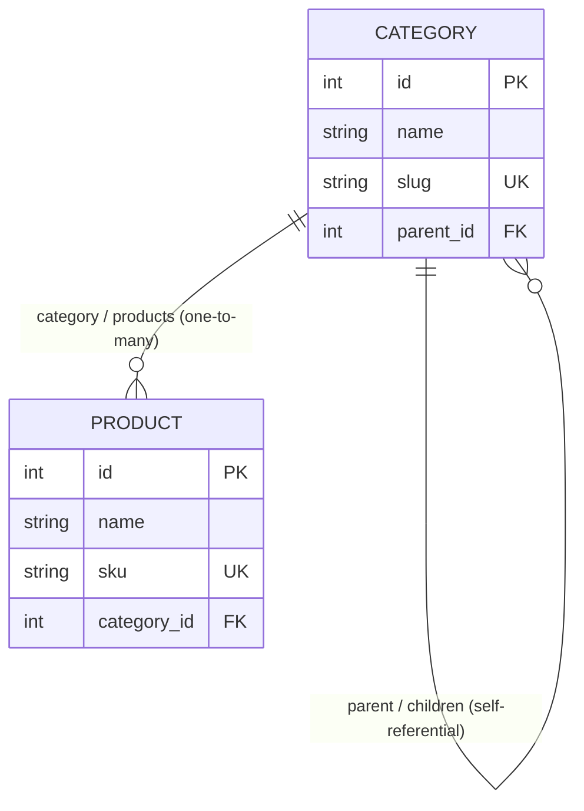
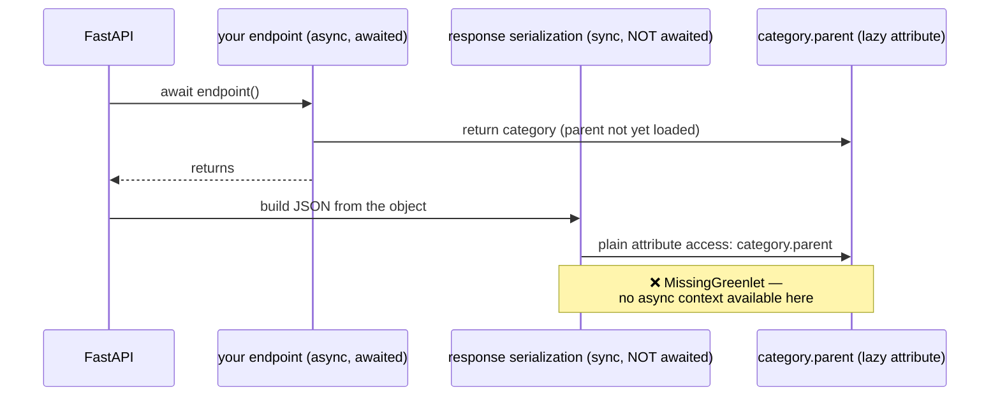
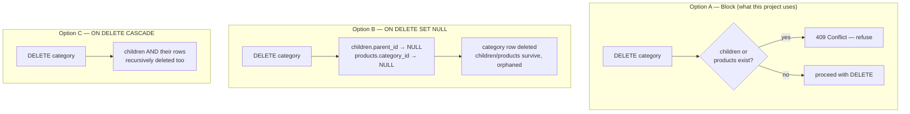
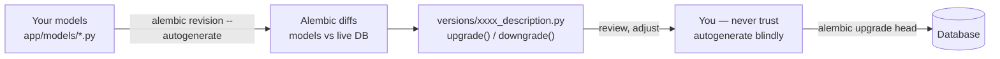

# SQLAlchemy & Alembic — A Guide for This Project

A from-scratch guide to SQLAlchemy (async ORM) and Alembic (migrations), written around your actual `e-commerce` codebase — `app/models/`, `app/core/database.py`, `app/api/`, and `alembic/`. Several sections below are built directly from real bugs we hit and fixed in this project, not just theory — that's deliberate, they're the lessons that actually stick.

---

## 1. What SQLAlchemy actually is

SQLAlchemy has two layers, and it matters which one you're looking at:

- **Core** — a Python API for building and executing raw-ish SQL (`select(...)`, `insert(...)`) without any class-mapping involved. Lower-level, closer to SQL.
- **ORM** (Object-Relational Mapper) — sits on top of Core. Maps Python classes (`Category`, `Product`) to database tables, and rows to objects. This is what you're using: `class Category(Base)` *is* the `category` table; a `Category` instance *is* a row.



Why an ORM at all, instead of writing SQL strings directly? Two things you get for free that matter here: (1) Python objects with real types (`category.name` is a `str`, not a column you have to remember), and (2) **Alembic can autogenerate migrations by diffing your model classes against the live database schema** — impossible if your schema only exists as scattered SQL strings.

---

## 2. Declaring models — what your `Base`/`Category`/`Product` classes actually mean

```python
# app/models/base.py
class Base(TimeStampMixin, DeclarativeBase):
    pass
```

`DeclarativeBase` is SQLAlchemy's mechanism for "every class that inherits from this becomes a mapped table." Your `TimeStampMixin` (also in `base.py`) adds `created_at`/`updated_at` columns to *every* model that inherits `Base` — that's why `Category` and `Product` both get timestamps without redeclaring them.

```python
# app/models/category.py
class Category(Base):
    __tablename__ = "category"

    id: Mapped[int] = mapped_column(Integer, primary_key=True, index=True)
    name: Mapped[str] = mapped_column(String, nullable=False)
```

- `__tablename__` — the actual SQL table name.
- `Mapped[int]` — a type annotation telling SQLAlchemy (and your type checker) what Python type this column produces. This is the modern (2.0-style) syntax; older SQLAlchemy code you'll see online uses `Column(Integer, ...)` directly without `Mapped[...]` — both work, but `Mapped[...]` gets you real static type checking, which is why your project uses it (and why `mypy strict = true` is in your `pyproject.toml`).
- `mapped_column(...)` — the actual column definition: type, constraints (`nullable`, `unique`, `primary_key`), defaults.

Each row in the table becomes one `Category` Python instance when you query it, and vice versa — `session.add(Category(name="Phones", ...))` becomes an `INSERT`.

---

## 3. The async engine and session — the two objects everything flows through

```python
# app/core/database.py
engine = create_async_engine(settings.DATABASE_URL, echo=True)

Sessionlocal = async_sessionmaker(bind=engine, class_=AsyncSession, expire_on_commit=False)

async def get_db():
    async with Sessionlocal() as session:
        yield session

SessionDependency = Annotated[AsyncSession, Depends(get_db)]
```

- **`Engine`** — manages the actual connection pool to the database. Created once, for the whole app's lifetime.
- **`Session`** — your working unit for one logical piece of work (in this app: one HTTP request). Tracks which objects you've loaded, what's changed, what needs to be flushed to the DB. **Never share a session across requests** — that's exactly what the per-request dependency below prevents.

### Why *async*, specifically

`FastAPI` runs on an event loop (ASGI). A normal *blocking* database call (like classic `psycopg2`) would freeze that entire event loop while waiting on the network — no other request could be handled meanwhile, defeating the whole point of async. `create_async_engine` + `aiosqlite`/`asyncpg` let the event loop do other work while waiting on I/O. This is exactly ADR-001 in your plan: *"Use SQLAlchemy async engine with asyncpg over sync SQLAlchemy — FastAPI is ASGI, blocking DB calls block the event loop."*

### The per-request session lifecycle



`get_db` is a **generator dependency**: the `yield` is the key — FastAPI calls this function, gets the session at the `yield` point, runs your whole endpoint with it, and only *after* the response is built does execution resume past the `yield`, closing the session. This is why every endpoint gets a fresh, isolated session, and why you never manually open/close a session yourself in `app/api/*.py`.

`expire_on_commit=False` matters for a subtle reason you actually hit: by default, SQLAlchemy *expires* all attributes on committed objects, forcing a fresh `SELECT` the next time you touch them. With `expire_on_commit=False`, after `session.commit()`, your Python object (e.g. `new_category`) keeps its already-known attribute values in memory — which is why `create_category` can return `new_category` directly after `commit()`/`refresh()` without an extra round-trip.

---

## 4. Querying — the patterns actually used in this codebase

```python
# fetch one row by primary key — simplest, most direct
category = await session.get(Category, id)

# fetch a filtered/limited set — build a SELECT, then execute it
stmt = select(Category)
result = await session.execute(stmt)
categories = result.scalars().all()

# fetch a single scalar value (used for your existence checks)
has_children = await session.scalar(
    select(Category.id).where(Category.parent_id == id).limit(1)
)
```

- **`session.get(Model, pk)`** — the fast path for "give me the row with this primary key." Checks the session's in-memory identity map first before hitting the DB.
- **`select(Model)`** — builds a Core `Select` statement (doesn't execute anything yet — it's just a query object, like building a URL before fetching it).
- **`session.execute(stmt)`** — actually runs it, returns a `Result` object.
- **`.scalars()`** — unwraps `Result` rows from `(Category,)` tuples into plain `Category` objects. Without it you'd get row-tuples back, which is almost never what you want when querying a single mapped class.
- **`session.scalar(stmt)`** — shortcut for "execute, then give me just the first column of the first row" — exactly what `delete_category`'s existence checks use: does *any* row matching this filter exist, without loading the whole object.

`await` is required everywhere here — every one of these does real network I/O against the database.

---

## 5. Relationships — how `Category` and `Product` actually connect

Your schema has two distinct relationship shapes:



```python
# app/models/category.py
parent = relationship("Category", remote_side=[id])
children = relationship("Category", back_populates="parent", passive_deletes=True)
products = relationship("Product", back_populates="category", passive_deletes=True)

# app/models/product.py
category = relationship("Category", back_populates="products")
```

- **`relationship(...)`** is a *Python-side convenience*, not a real column — it doesn't exist in the database. The actual link is the `parent_id`/`category_id` foreign key columns; `relationship()` just lets you write `category.products` in Python instead of manually writing a `SELECT ... WHERE category_id = ...` yourself.
- **`back_populates`** must be symmetric — it tells SQLAlchemy "these two `relationship()` declarations are two ends of the *same* link." `Product.category` says `back_populates="products"`, so `Category` **must** have an attribute literally named `products` pointing back. This is a real bug you hit early on: `Product.category` referenced `Category.products` before that attribute existed on `Category` at all — SQLAlchemy didn't catch it at import time, only when it configured all mappers on first real use, raising `InvalidRequestError`.
- **`remote_side=[id]`** — only needed for the *self-referential* relationship (`Category.parent`). Since both sides of the relationship are the same table, SQLAlchemy can't otherwise infer which side is the "one" and which is the "many" purely from the foreign key — `remote_side` disambiguates it explicitly.

---

## 6. The async lazy-loading trap (a real bug you hit — worth understanding deeply)

`relationship()` defaults to **lazy loading**: the related object/collection isn't fetched from the DB until you actually access the attribute (`category.parent`). With a synchronous engine, this is invisible — touching the attribute just quietly runs a blocking query on the spot.

With an **async** engine, this still works *most* of the time via a trick called greenlet-spawning — but it only works while you're still inside SQLAlchemy's own `await`-driven call stack.



This is exactly what happened when `CategoryRead`/`ProductRead` used to nest `parent`/`category` objects directly in the response schema: FastAPI's response serialization step runs your ORM object through Pydantic *after* your endpoint has already returned, in a plain synchronous context with no `await` available — so any relationship SQLAlchemy hasn't already loaded crashes with `MissingGreenlet: greenlet_spawn has not been called`.

Three ways to avoid this (all real, all valid — pick based on what you need):

1. **Don't expose nested relationship objects in your response schema at all** — just the raw FK id (`parent_id`, `category_id`). This is what this project does today: no relationship traversal happens during serialization, so the problem can't occur. Simplest, and matches "just CRUD" scope.
2. **Eager-load explicitly per query**, e.g. `select(Category).options(joinedload(Category.parent))` — forces the related row to load *during* the original awaited query, so it's already in memory by the time serialization happens. This is genuinely useful later (your plan's Day 27 covers exactly this).
3. **Set `lazy="joined"` on the `relationship()` itself** — makes eager loading the default for every query automatically, no `.options()` needed per call site, at the cost of always paying the join.

---

## 7. Constraints and `IntegrityError`

Uniqueness (`Category.slug`, `Product.sku`) and foreign keys are enforced by the **database**, not by SQLAlchemy in Python. When a constraint is violated, the driver raises an error that SQLAlchemy wraps as `sqlalchemy.exc.IntegrityError`. Your `create_category`/`create_product` catch exactly this:

```python
try:
    await session.commit()
    await session.refresh(new_category)
except IntegrityError:
    await session.rollback()
    raise ConflictError(detail="Category with this slug already exists")
```

Two things worth remembering, both real bugs you hit:

- **`IntegrityError` is a single exception type covering *every* constraint violation** — duplicate unique value, `NOT NULL` violation, or a broken foreign key all raise the *same* Python exception class. If your code assumes `except IntegrityError` always means "duplicate," you'll mislabel a completely different failure (this happened here: an invalid `category_id` got reported as `"Product with this sku already exists"`, which was just wrong). The fix used in this project: **validate what you can predict *before* attempting the write** (`session.get(Category, product.category_id)` to check it exists), so that anything still reaching the `except IntegrityError` block really can only be the one case you intend to catch.
- **Always `rollback()` after catching an error inside a `try`/`commit()` block.** A failed `commit()` leaves the session's transaction in a broken state — further operations on that same session will themselves fail unless you roll back first.

---

## 8. Deletion, foreign keys, and cascade behavior

This project went through three different designs for "what happens when you delete a category that has products/subcategories" — worth understanding all three, since which one is "right" depends entirely on the domain:



- **Option A (block)** — implemented as an explicit application-level check (`delete_category` in `app/api/category.py`) *before* attempting the delete. Safest default for a catalog: you never silently lose or orphan data. This is what `category_id`/`parent_id` being `NOT NULL`-compatible ultimately reflects — nothing in this schema is designed to *become* orphaned.
- **Option B (`ondelete="SET NULL"`)** — a real DB-level constraint (`ForeignKey("category.id", ondelete="SET NULL")`), requires the FK column to be nullable. This project actually built and verified this at the database level before deciding the application-level block (Option A) was the better fit — the migration and model support for it is a good worked example even though it's not the active behavior today.
- **Option C (`ondelete="CASCADE"`)** — not used here, but worth knowing: deleting a category would recursively delete every subcategory and product under it. Dangerous for a catalog (one delete could wipe a whole tree), but correct for genuinely dependent data (e.g. deleting an order should delete its order-line-items).

Two SQLAlchemy-specific mechanics worth remembering if you revisit this:
- `ondelete="..."` on `ForeignKey(...)` only changes what's written into the **database schema** — it does nothing by itself until an actual DB migration applies it.
- `passive_deletes=True` on a `relationship()` tells the **ORM** "don't try to manage this in Python (loading and nulling child rows yourself) — trust the database's own `ON DELETE` behavior instead." Without it, SQLAlchemy's default behavior is to try to null out child foreign keys itself during a Python-level delete, which is *also* how a real bug surfaced here: deleting a category with `NOT NULL` products crashed, because the ORM tried to null a column that the database wouldn't allow to be null.

---

## 9. Alembic — migrations, autogenerate, and the SQLite batch-mode gotcha

Alembic's job: diff your current model classes (`Base.metadata`) against the live database schema, and generate a Python script that transforms one into the other.



Standard workflow:
```bash
alembic revision --autogenerate -m "add unique constraint to slug"
# → review the generated file — autogenerate is a starting point, not gospel
alembic upgrade head
```

### Why "review the generated file" isn't optional advice

Autogenerate does **not** reliably detect everything — server-default changes on existing columns, and (the one you hit repeatedly) **`ondelete=` changes on foreign keys**, often need hand-editing.

### The SQLite-specific problem you solved twice in this project

SQLite doesn't support `ALTER TABLE ... ADD CONSTRAINT` at all. Any migration that tries to add/modify a constraint directly fails with:
```
NotImplementedError: No support for ALTER of constraints in SQLite dialect.
Please refer to the batch mode feature...
```

**Batch mode** works around this: instead of altering the table in place, Alembic builds a *new* table with the desired final shape, copies every row over, drops the old table, and renames the new one into its place.

```python
with op.batch_alter_table('category') as batch_op:
    batch_op.create_unique_constraint('uq_category_slug', ['slug'])
```

The extra wrinkle: your original tables were created with **unnamed** foreign key constraints (`sa.ForeignKeyConstraint(['parent_id'], ['category.id'])`, no `name=`). SQLite genuinely has no name for them — `insp.get_foreign_keys(...)` confirmed `'name': None`. You can't `drop_constraint()` something with no name to reference. The fix — documented in Alembic's own cookbook, and now in this project's migrations — is passing a `naming_convention` directly to `batch_alter_table()`, which makes Alembic compute a deterministic name for the anonymous constraint *during that operation*, referenceable via `batch_op.f(...)`:

```python
naming_convention = {"fk": "fk_%(table_name)s_%(column_0_name)s_%(referred_table_name)s"}

with op.batch_alter_table('category', naming_convention=naming_convention) as batch_op:
    batch_op.drop_constraint(batch_op.f('fk_category_parent_id_category'), type_='foreignkey')
    batch_op.create_foreign_key(
        batch_op.f('fk_category_parent_id_category'),
        'category', ['parent_id'], ['id'], ondelete='SET NULL',
    )
```

Once a constraint has been created *with* an explicit name this way, future migrations touching it don't need the `naming_convention` trick anymore — they can reference the name directly, which is exactly what the follow-up `product category not null` migration in this project does.

### One more SQLite gotcha this project hit: foreign keys are off by default

Unlike PostgreSQL, **SQLite does not enforce foreign key constraints unless you explicitly turn it on**, per connection:
```python
@event.listens_for(Engine, "connect")
def _enable_sqlite_foreign_keys(dbapi_connection, connection_record):
    if settings.DATABASE_URL.startswith("sqlite"):
        cursor = dbapi_connection.cursor()
        cursor.execute("PRAGMA foreign_keys=ON")
        cursor.close()
```
Without this, invalid foreign keys (e.g. a product referencing a category that doesn't exist) would silently succeed on SQLite — a correctness bug that simply wouldn't exist on PostgreSQL, which enforces this by default. Something to keep in mind as you move toward Postgres per your plan: a few of these SQLite-only behaviors (this pragma, batch-mode migrations) won't be needed at all once you're off SQLite, but until then they're load-bearing.

### Always test a migration against a copy first

Before running a migration that alters constraints against your real dev database, copy the `.db` file, point `DATABASE_URL` at the copy, and run `alembic upgrade head` there first. This project did exactly that for every constraint-changing migration — cheap insurance against a migration that looks right but fails halfway through a batch-mode table rebuild.

---

## 10. Your codebase, mapped to the concepts above

| File | What to look for |
|---|---|
| `app/models/base.py` | `DeclarativeBase`, `TimeStampMixin` — §2 |
| `app/models/category.py`, `app/models/product.py` | Relationships, `back_populates`, `passive_deletes`, `ondelete` — §5, §8 |
| `app/core/database.py` | Async engine, session factory, `get_db` dependency, SQLite FK pragma — §3, §9 |
| `app/api/category.py`, `app/api/product.py` | Query patterns, `IntegrityError` handling, existence checks before delete — §4, §7, §8 |
| `app/schemas/category.py`, `app/schemas/product.py` | Why these expose only `parent_id`/`category_id`, not nested objects — §6 |
| `alembic/versions/*.py` | Batch mode, `naming_convention`, autogenerate review — §9 |

Ask me to walk through any specific file against this once you want a deeper review of it.
